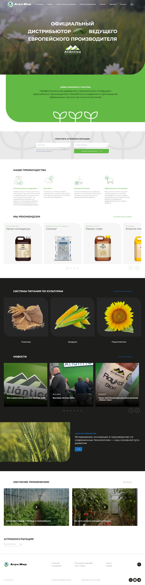

## О проекте

Верстка многостраничного сайта и настройка JavaScript функционала для компании АгроМир

**Реализованный функционал:**
* Анимации
* Слайдеры (использована библиотека 'slick')
* Пагинация
* Фильтры каталога
* Модальные окна

## Запуск приложения

> Откройте сайт по ссылке: https://aleksandrkuzmin-dev.github.io/agromir/

## Скриншот главной страницы:

